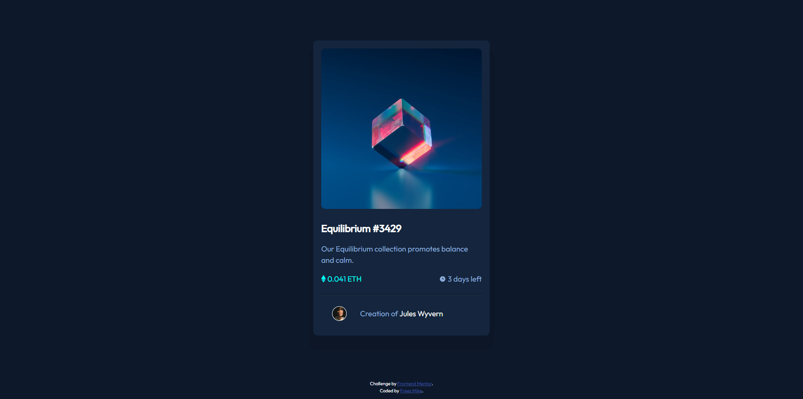

# Frontend Mentor - NFT preview card component solution

This is a solution to the [NFT preview card component challenge on Frontend Mentor](https://www.frontendmentor.io/challenges/nft-preview-card-component-SbdUL_w0U). Frontend Mentor challenges help you improve your coding skills by building realistic projects. 

## Table of contents

- [Overview](#overview)
  - [The challenge](#the-challenge)
  - [Screenshot](#screenshot)
  - [Links](#links)
- [My process](#my-process)
  - [Built with](#built-with)
  - [What I learned](#what-i-learned)
  - [Continued development](#continued-development)
- [Author](#author)

**Note: Delete this note and update the table of contents based on what sections you keep.**

## Overview

### The challenge

Users should be able to:

- View the optimal layout depending on their device's screen size
- See hover states for interactive elements

### Screenshot

### Links

- [Solution URL](https://github.com/mikeFrees/nft-preview-card-component-main)
- [Live Site URL](https://mikefrees.github.io/nft-preview-card-component-main/)

## My process

### Built with

- Semantic HTML5 markup
- CSS custom properties
- Flexbox
- CSS Grid
- Mobile-first workflow
- pseudo elements & classses
- SCSS
- fontsource
- NPM
- normalize.css

### What I learned

i learned how to write the package.json for NPM and how to initialize my project. Also i started to understand how to use the pseudo classes and elements. i had some trouble with the placement of an svg element and how to create a good transparent color overlay on hover put i managed to finally figure it out.

I tried to use bootstrap at the start of this project but my HTML file felt too cluttered with al these divs added to it, so i took a step back and continued with HTML and SCSS for the moment.

### Continued development

I will try to read up on how to use bootsrap and try to get a better understanding of it and i would like to document my code better and write my Read me file while i develop a project so that i can recal where i got my ideas from and which rescources i used.

## Author

- LinkedIn - [Frees Mike](https://www.linkedin.com/in/mike-frees/)
- Frontend Mentor Profile - [Mike Frees](https://www.frontendmentor.io/profile/mikeFrees)
